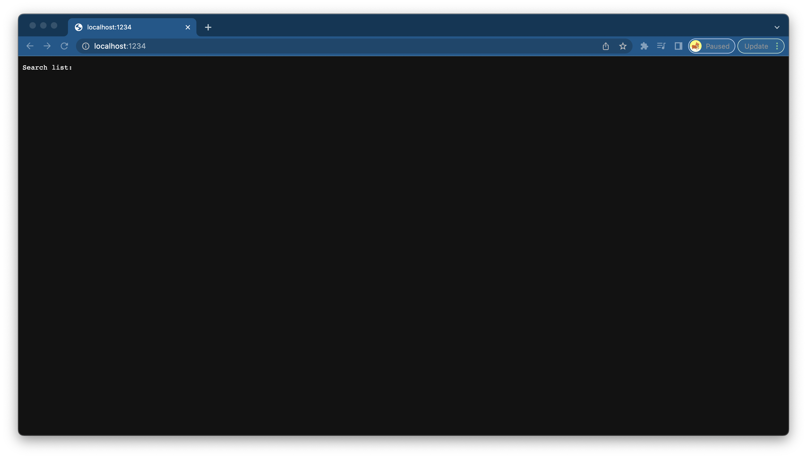
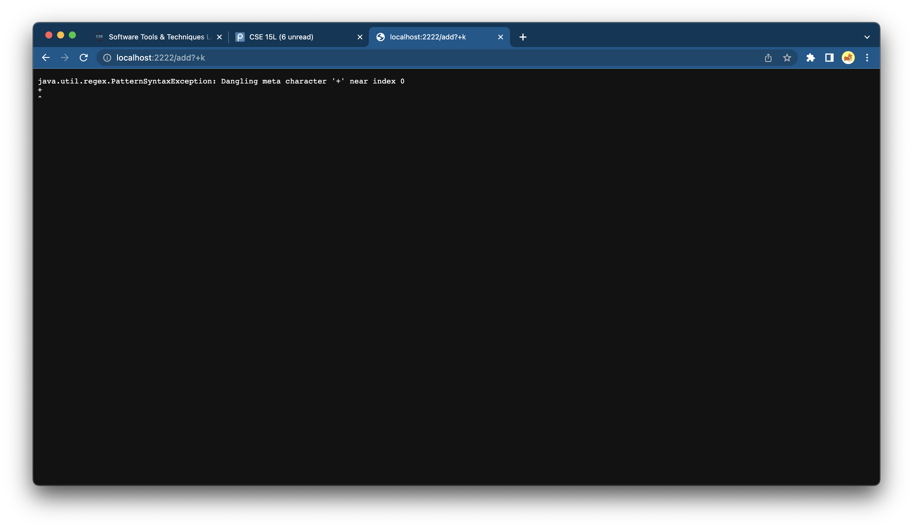
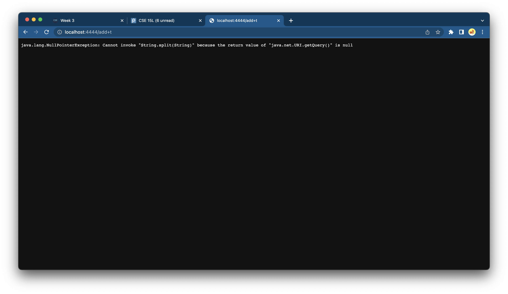
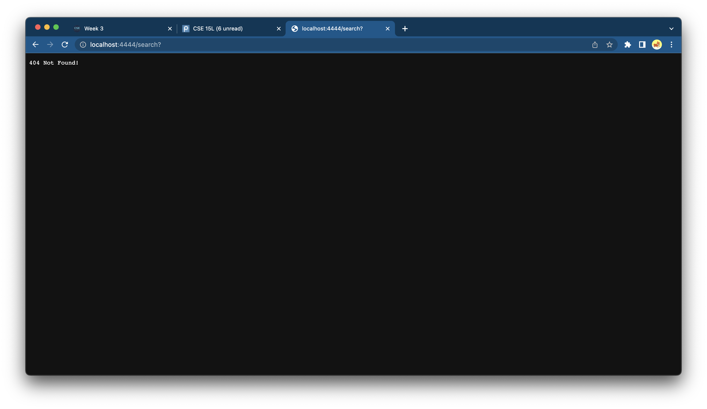

# Week 3 Lab Report: Servers and Bugs
---

## Part I - Simplest Search Engine

In Week 2 Lab, we learned about the URLHandler Interface and web servers. After trying out the different paths and query combinations from the provided file, we were tasked to create our own.  We made a simple search engine that implements a web server, with paths for adding strings to a list and querying the list.

Below is the code for my `SearchEngine.java`:  
```
import java.io.IOException;  
import java.net.URI;`  
import java.util.ArrayList;

class Handler implements URLHandler {

    public String handleRequest(URI url) {

        ArrayList<String> searches = new ArrayList<String>();
        searches.size();


        if (url.getPath().equals("/")) {
            return String.format("Search list:", searches);       
        } else {
            System.out.println("Path: " + url.getPath());

            if (url.getPath().contains("/add")) {
                String[] parameters = url.getQuery().split("+");
                for (int i = 0; i <= searches.size(); i ++) {
                    searches.add(parameters[i]);
                }

                System.out.println(searches);

            if (url.getPath().contains("/search")) {
                //code to query ArrayList goes here
            }
        }
             System.out.println(searches);
            }
        
            return "404 Not Found!";
        
    }
    class SearchEngine {
    public static void main(String[] args) throws IOException {
        if(args.length == 0){
            System.out.println("Missing port number! Try any number between 1024 to 49151");
            return;
        }
        int port = Integer.parseInt(args[0]);

        Server.start(port, new Handler());
    }
}
}
```
I was only successful in creating the server. To reach this page, all I did was compile and run my server:


I am no Java expert, and could only find interesting errors with my code.  
For example, here is a PatternSyntaxException I created. I'm guessing this was given because the regex created an extra +.


Another example, a classic NullPointerException. This was given because I didn't code a return value properly for the getQuery method.


Finally, an error that was actually written in my code. I suppose that can be considered a win? This was thrown because the path I typed didn't contain `/add`.


## Part II - Debugging

In the Week 3 Lab, we learned about JUnit and Symptoms, Bugs, and Failure-inducing Input.

Below are my two examples of bugs and their fixes.

### Bug 1

The failure-inducing input (the code of the test): 

The symptom (the failing test output):

The bug (the code fix needed):

Then, explain the connection between the symptom and the bug. Why does the bug cause that particular symptom for that particular input?


### Bug 2


The failure-inducing input (the code of the test): 

The symptom (the failing test output):

The bug (the code fix needed):

Then, explain the connection between the symptom and the bug. Why does the bug cause that particular symptom for that particular input?


Just kidding I've been staring at the computer for 12 hours now and I give up for now
