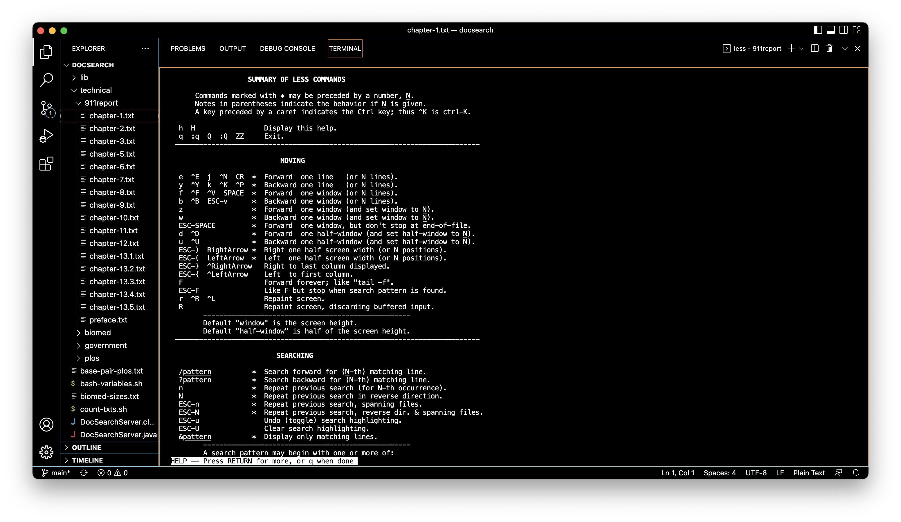
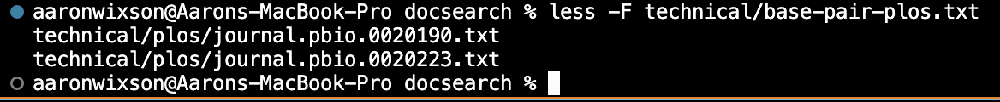
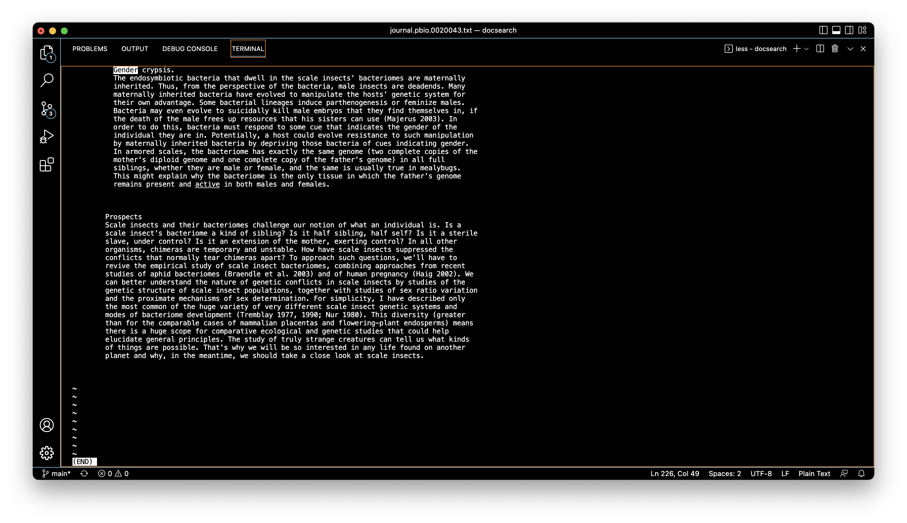

# Week 5 Lab Report: Researching Commands

This week, we learned the commands `less`, `find`, and `grep`. Each of these have general uses, and also have alternate/additional uses called *command line options*. Theses command line options allow you to use these commands in more specific ways.  

To find more information about these command line options, you can use the command `man` (short for manual) + the command of interest.  

## The `less` command
The `less` command utility displays the contents of a file or command output one page at a time. It is most commomly used to open and parse through large files.  To use `less`, simply pass the name of a file to it, like so:

After pressing enter, the utility will start and the .txt file will be opened into the terminal. The first helpful tool for using `less` is typing `h`, which will open a summary of commands and instructions for utilizing `less`. 

There are a few options `less` has that can be used to modify the default output and behavior. Some of the most common options are: `-F`, `-p`, and `-N`.

### `-F`
The `-F` option will exit the `less` command if the file can be fully displayed on one page. This is useful if you just want to read the file and not use any of the navigation or search tools. For example, if I want to display the contents of `technical/base-pair-plos.txt` into the terminal, I can use `less -F` to do that.

### `-p`
The `-p` option allows you to open a file with a search term. Instead of opening the file to the first page, it will open to the first match of your search. This is useful when you want to skip to a specific part of a file. For example, there is an interesting paragraph in `technical/plos/journal.pbio.0020043.txt` about bacteria with strange behavior towards male host insects. Instead of using `less` and scrolling to find that paragraph, I can use `less -pGender` to shorten my search efforts.

Typing this command, the file is opened several pages down and my search term is highlighted:

### `-N`
The `-N` command option opens the file with numbered lines. This can help with readability and keeping track of where you are in a file, as well as providing more perspective of the file's size.

As seen in the previous screenshots, the default `less` command doesn't display line numbers. When initiating `less` with the `-N` option, The line numbers will then be displayed on the file.

