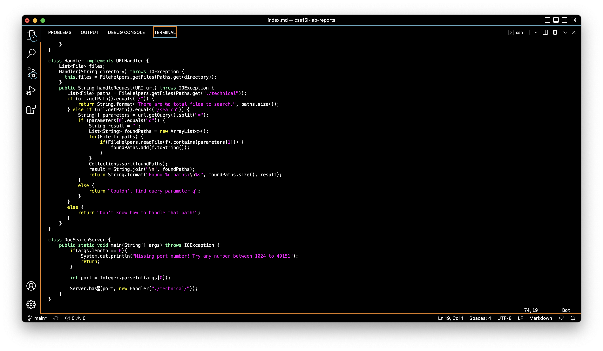

## Week 7 Lab Report: Vim
---

## Part I: Optimizing Vim Workflow
One of the goals of Week 6 Lab was to pick a task from the list below and find the *shortest* sequence of `vim` commands needed to accomplish it. The goal was to accomplish the task in under 30 total keys pressed.

I chose the first option: In `DocSearchServer.java`, change the name of the `start` parameter of `getFiles`, and all of its uses, to be called `base`.    

Before starting, I did some more researching of `vim` commands to better prepare myself for the task. I found this [cheat sheet](https://vim.rtorr.com/), and experimented with the macros commands, but found the best way to accomplish this task is to use the method taught in the lecture on Monday of Week 6.

The full workflow was:  
`/star<Enter>cebase<ESC>n.n.n.:w`

### `/star<Enter>`
`/star` was enough of the word needed to find the string, and ensure no other strings would be found. Any shorter, like `/sta`, would have also highlighted the word `static`, which would add more keystrokes to our total count to skip. After pressing `<Enter>`, the cursor is placed at the start of the first occurence of the searched pattern.

6 keystrokes were required to reach this point.

### `ce`
`ce` is an editing command which deletes everything after the cursor to the end of the current word, and switches to insert mode. Since the last command left the cursor at the beginning of the word, `ce` deletes the entire word.

The `ce` command adds just 2 keystrokes.

### `base<ESC>`
`base<ESC>` types `base` and then exits insert mode.

This sequence adds 5 more keystrokes.

### `n`
`n` goes to the next instance of the searched pattern.

This adds just 1 keystroke to our total.

### `.`
`.` repeats the last string of commands. In this case, it repeats `ce` and `base<ESC>`, effectively performing 7 keystrokes in 1.

### `n.n.`
To finish our task, we need to use the commands `n` and `.` twice more to change the remaining `start` strings to `base`.  

This adds 4 more keystrokes.

I pressed `n` once more after to show whats displayed once no more `start` strings were left to be changed. I don't count this in my total number because I already knew I was finished after experimenting so many times.

### `:w<Enter>`
Last but certainly not least, `:w<Enter>` is used to save the changes made. This is indicated by the very bottom line of the terminal.

`:w<Enter>` adds 4 more keystrokes, because `<shift>` is needed to type the `:`. 

In total, 23 keys are pressed to accomplish this task.

## Part II: Workflow Management Strategies
For Part II, we will test two different strategies of editing a program when it needs to be used remotely. The first is by logging into a `ssh` session and making the change there, and the second is by making the edit locally and using `scp` to copy the change into the remote computer.

### Editing from a `ssh` Session
This method is actually the method I used to do Part I. It took 30 seconds to do all the steps from Part I, and then run `bash test.sh`.

### Local Edits and `SCP`
This method took a lot longer to complete at 50 seconds. It took significantly more steps than just logging into the remote acocunt first. In addition to that, it took me a great deal of time just to figure out how to scp into the correct location.

### Conclusion
Of these two styles, I highly preferred the first. It is much easier to just log into the `ssh` session first and work than to make changes, than to work remotely, scp to the remote, and then log into `ssh` to verify the changes. I don't believe that there are any factors that may change my decision for the other method. I'd rather just log in first, do the work, and then log out.

