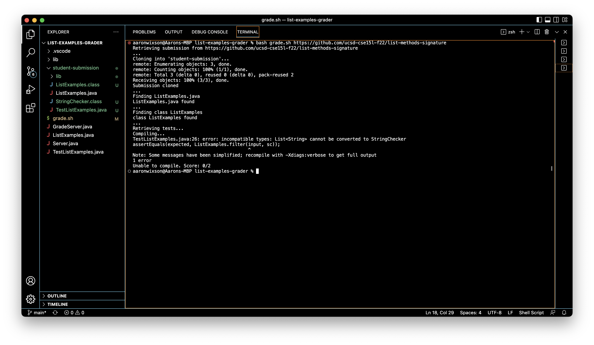

# Week 9: Grade Server
---
## I. `grade.sh` Code

```
set -e

FILE_NAME="ListExamples.java"
CLASS_NAME="class ListExamples"

CP=".:../lib/hamcrest-core-1.3.jar:../lib/junit-4.13.2.jar"

echo "Retrieving submission from $1"
echo "..."

rm -rf student-submission
git clone $1 student-submission

if [ $? -eq 0 ]
then
    echo "Submission cloned"
    echo "..."
else
    echo "ERROR: Clone failed. Check URL and try again."
    exit 1
fi

cd student-submission/
echo "Finding $FILE_NAME"

if [ -f $FILE_NAME ]
then 
    echo "$FILE_NAME found"
    echo "..."
else
    echo "ERROR: $FILE_NAME not found. Ensure file exists and is named correctly."
    exit 1
fi

echo "Finding $CLASS_NAME"

grep -q "$CLASS_NAME" ./$FILE_NAME

if [ $? -eq 0 ]
then
    echo "$CLASS_NAME found"
    echo "..."
else
    echo "$CLASS_NAME not found. Ensure class exists and is named correctly."
    exit 1
fi

echo "Retrieving tests..."

cd ../
cp TestListExamples.java student-submission
cp -r lib student-submission
cd student-submission

echo "Compiling..."

set +e
javac -cp $CP *.java

if [ $? -eq 0 ]
then
    echo "Compiled successfully"
    echo "..."
else
    echo "Unable to compile. Score: 0/2"
    exit 1
fi  

echo "Running tests..."
echo "..."

rm -rf results.txt
java -cp $CP org.junit.runner.JUnitCore TestListExamples > results.txt

if [ $? -eq 0 ]
then
    cat results.txt | grep OK
    echo "All tests passed! Score: 2/2"
 else
    cat results.txt | grep 'Tests run:' 
    if grep -q "There were 2" results.txt
    then
        echo "Score: 0/2"
    elif grep -q "There was 1" results.txt
    then
        echo "Score: 1/2"   
    fi   
fi
```

## II. `grade.sh` Demonstrations
### 1. https://github.com/ucsd-cse15l-f22/list-methods-filename

In this repository, the student named their submission file wrong. The `grade.sh` script gives feedback to ensure their file is named correctly.


### 2. https://github.com/ucsd-cse15l-f22/list-methods-lab3

This repository contains two incorrect methods. The score for this submission is 0.


### 3. https://github.com/ucsd-cse15l-f22/list-methods-corrected

This repository has corrected methods, and receives a perfect score.


## III. _Trace_ of `grade.sh`
To trace `grade.sh`, I will use the second example, in which the score is 0/2.

### `set -e`
* stout:  
* sterr:
### `FILE_NAME="ListExamples.java"`
* stout:  
* sterr:
### `CLASS_NAME="class ListExamples"`
* stout:  
* sterr:
### `CP=".:../lib/hamcrest-core-1.3.jar:../lib/junit-4.13.2.jar"`
* stout:  
* sterr:
### `echo "Retrieving submission from $1"`
* stout:  
* sterr:
### `echo "..."`
* stout:  
* sterr:
### `rm -rf student-submission`
* stout:  
* sterr:
### `git clone $1 student-submission`
* stout:  
* sterr:
### `if [ $? -eq 0 ]`
* stout:  
* sterr:
* condition: 
### `then echo "Submission cloned" echo "..."`
* stout:  
* sterr:
### `else echo "ERROR: Clone failed. Check URL and try again."`
* Does not execute.
### `exit 1`
* Does not execute.
### `fi`
* stout:  
* sterr:
### `cd student-submission/`
* stout:  
* sterr:
### `echo "Finding $FILE_NAME"`
* stout:  
* sterr:
### `if [ -f $FILE_NAME ]`
* stout:  
* sterr:
* condition:
### `then echo "$FILE_NAME found" echo "..."`
* stout:  
* sterr:
### `else echo "ERROR: $FILE_NAME not found. Ensure file exists and is named correctly."`
* Does not execute.
### `exit 1`
* Does not execute.
### `fi`
* stout:  
* sterr:
### `echo "Finding $CLASS_NAME"`
* stout:  
* sterr:
### `grep -q "$CLASS_NAME" ./$FILE_NAME`
* stout:  
* sterr:
### `if [ $? -eq 0 ]`
* stout:  
* sterr:
* condition:
### `then echo "$CLASS_NAME found" echo "..."`
* stout:  
* sterr:
### `else echo "$CLASS_NAME not found. Ensure class exists and is named correctly."`
* Does not execute.
### `exit 1`
* Does not execute.
### `fi`
* stout:  
* sterr:
### `echo "Retrieving tests..."`
* stout:  
* sterr:
### `cd ../`
* stout:  
* sterr:
### `cp TestListExamples.java student-submission`
* stout:  
* sterr:
### `cp -r lib student-submission`
* stout:  
* sterr:
### `cd student-submission`
* stout:  
* sterr:
### `echo "Compiling..."`
* stout:  
* sterr:
### `set +e`
* stout:  
* sterr:
### `javac -cp $CP *.java`
* stout:  
* sterr:
### `if [ $? -eq 0 ]`
* stout:  
* sterr:
* condition:
### `then echo "Compiled successfully" echo "..."`
* stout:  
* sterr:
### `else echo "Unable to compile. Score: 0/2"`
* Does not execute.
### `exit 1`
* Does not execute.
### `fi`  
* stout:  
* sterr:
### `echo "Running tests..."`
* stout:  
* sterr:
### `echo "..."`
* stout:  
* sterr:
### `rm -rf results.txt`
* stout:  
* sterr:
### `java -cp $CP org.junit.runner.JUnitCore TestListExamples > results.txt`
* stout:  
* sterr:
### `if [ $? -eq 0 ]`
* stout:  
* sterr:
* condition:
### `then cat results.txt | grep OK echo "All tests passed! Score: 2/2"`
* Does not execute.
 ### `else cat results.txt | grep 'Tests run:'`
 * stout:  
* sterr:
### `if grep -q "There were 2" results.txt`
* stout:  
* sterr:
### `then echo "Score: 0/2"`
* stout:  
* sterr:
### `elif grep -q "There was 1" results.txt`
* Does not execute.
### `then echo "Score: 1/2"`
* Does not execute.
### `fi`   
* stout:  
* sterr:
### `fi`
* stout:  
* sterr: