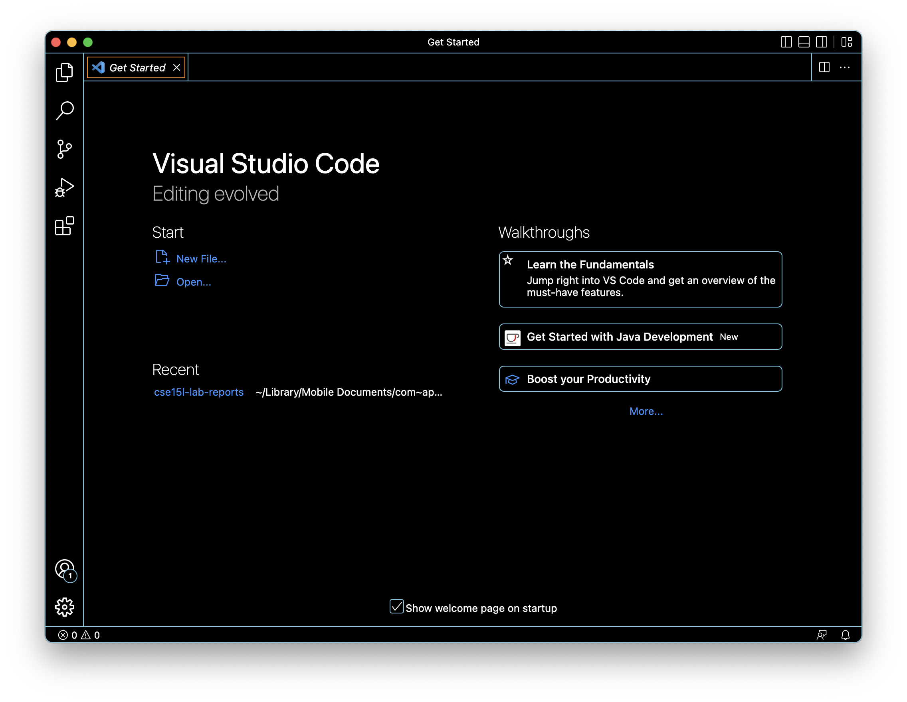
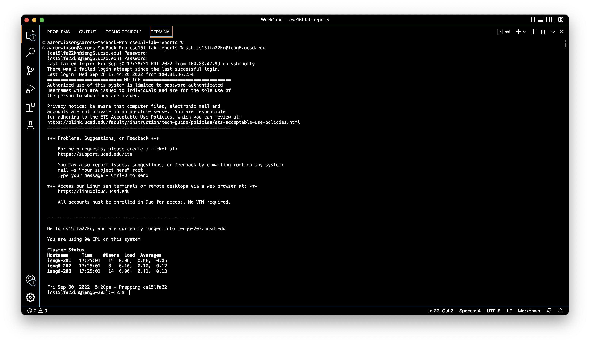
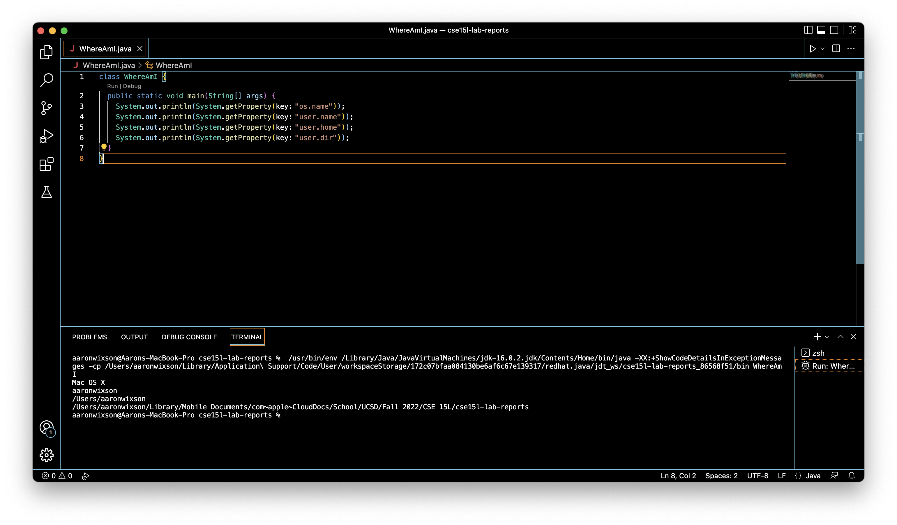
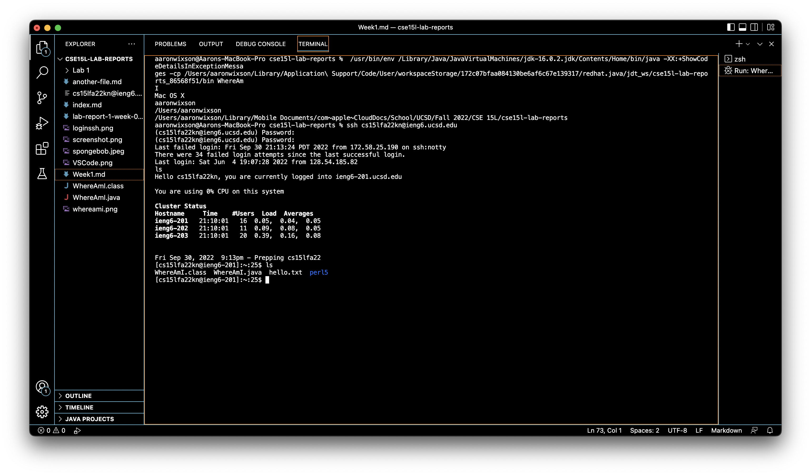
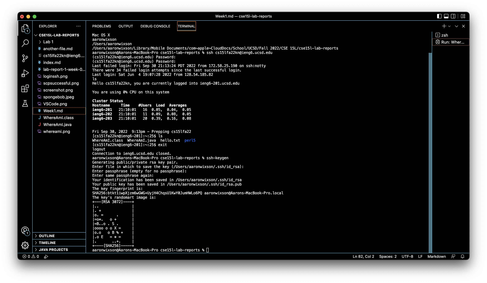

# Week 1 Lab Report: Remote Access
---
In this tutorial, we'll be covering the following topics:  
[1. Installing VScode](##Installing-VSCode)  
[2. Remotely Connecting to ETS Accounts](##Remotely-Connecting-to-ETS-Accounts)  
[3. Terminal Commands](##Terminal-Commands)  
[4. Moving Files With scp](##Moving-Files-With-scp)  
[5. Setting an SSH Key](##Setting-an-SSH-Key)  
[6. Optimizing Remote Running](##Optimizing-Remote-Running)

---
## Installing VSCode
Before we remotely access our CSE 15L account, we need to install VSCode. Navigate to [this website](https://code.visualstudio.com/) and follow the instructions for installation.  

When it's installed, open the application and a window should appear like this:

## Remotely Connecting to ETS Accounts
Next, we'll connect to our course-specific account for CSE 15L. To do this, we'll first need to find our account and set up its password here:
  
[https://sdacs.ucsd.edu/~icc/index.php](https://sdacs.ucsd.edu/~icc/index.php)

After setting your password, you'll need to wait about 15 minutes for the password to take effect. Patience is a virtue!  

While we're waiting, if you are on a Windows computer, you'll need to install the OpenSSH client, a program that allows your computer to connect to others that have this kind of account.
[Install OpenSSH here.](https://docs.microsoft.com/en-us/windows-server/administration/openssh/openssh_install_firstuse)

If you're on a Mac or Linux computer, congrats! You don't need to download Open SSH, because your computer is better than Windows. (Just kidding, it has something to do with Unix operating systems)

Next, open a terminal in VSCode. Do this by selecting Terminal → New Terminal in the menu bar. Or, you can press ctrl+` if you're feeling fancy. 

Once you've opened your terminal, type the following, replacing the zz with the letters in your account, and press enter:  
 `ssh cs15lfa22zz@ieng6.ucsd.edu`

Next, type in your password and press enter. You won't receive feedback from the terminal while you're typing, so it may take you a couple (or many) times to successfully log in. Once logged in, your terminal will look something like this:

Congratulations! You've successfully accessed your CSE 15L account remotely. Do you feel like a hacker yet?
## Terminal Commands
Now that we're logged in, we'll try out some commands in the terminal. Below is a list of useful commands to try, along with their operations because I know you forgot. 
* `cd <path>` → change the directory the shell is working from
* `ls` → lists the files and folders in the current directory 
* `cat <file1>` prints the contents of one or more files
* `pwd` prints the directory the shell is working from
## Moving Files With scp
One of the greatest benefits of remote connection is the ability to copy files back and forth between computers. To do this, we use the command `scp` from the *client*, **your** computer. Log out of SSH by using the command `exit`.

Next, create a new file on your computer called `WhereAmI.java`, and copy/paste the following:

`class WhereAmI {
  public static void main(String[] args) {
    System.out.println(System.getProperty("os.name"));
    System.out.println(System.getProperty("user.name"));
    System.out.println(System.getProperty("user.home"));
    System.out.println(System.getProperty("user.dir"));
  }
}
`  

After you paste this code into your new `WhereAmI.java` file, we need to compile and run the program by typing these commands:

`javac WhereAmI.java`  
`java WhereAmI`  

Your terminal should now look like this:

To copy this program into our CSE 15L account, we will use the `scp` command:

`scp WhereAmI.java cs15lfa22zz@ieng6.ucsd.edu:~/`

You will then be prompted to enter your password. Again, you won't see feedback when typing in your password so be careful doing this so you don't mess it up!

To check that we were successful, we'll log into our CSE 15L account and use the `ls` command.

We can see that `WhereAmI.java` is now on our CSE 15L account!
## Setting an SSH Key
Now, if you're like me and my 34 failed login attempts, you've become quite annoyed typing your password when you want to access you account. To avoid this irritating task, we can create what is called an `ssh` key.  
An `ssh` key utilizes a program called `ssh-keygen`, which creates a pair of files called the *public key* and the *private key*.  
The *public key* is is copied to a particulat location on the *server*, and the *private key* in a location on the *client*. Then, the `ssh` command uses these keys in place of your password.  
To set this up, log out of your CSE 15L account and run the command `ssh-keygen`. You'll be given a prompt similar to the following:  
 `Enter file in which to save the key (/Users/aaronwixson/.ssh/id_rsa):`  
 Press `enter` to specify the default path, and `enter` once or twice more to save your *public key*. 
 
Now we need to copy our *public key* to the `.ssh` directory of your CSE 15L account on the server.  
Log into `ssh`, use the command `mkdir .ssh`, and `exit` to log back out. Note that nothing will happen when you run the `mkdir .ssh` command.  

From the client, we'll now `scp` the file used to save our *public key*. When I did this nothing happened.
## Optimizing Remote Running
Now that we've learned so much about remote access, there are a few tricks we can use to make our work between two computers even easier. Some of these are:  
* logging into `ssh` and calling a command at the same time. For example:  
`ssh cs15lfa22zz@ieng6.ucsd.edu "ls"`
* running multiple commands on the same line by separating them with semicolons. For example:  
`cp WhereAmI.java OtherMain.java; javac OtherMain.java; java WhereAmI`
* Using the up-arrow to repeat previous commands.